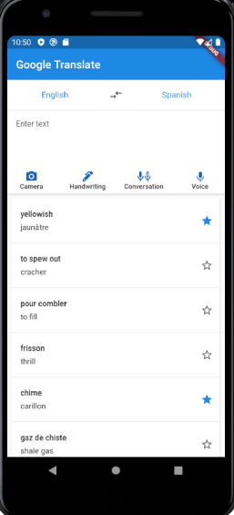
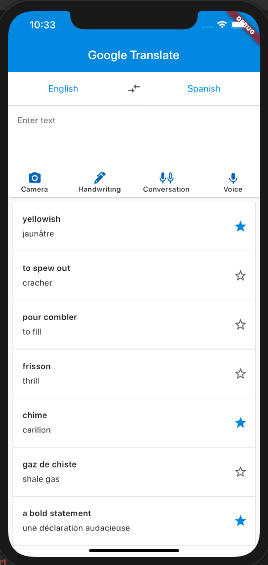
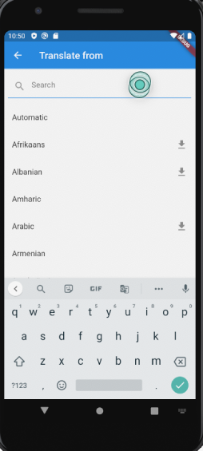
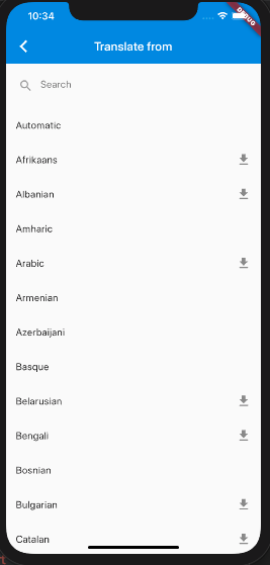
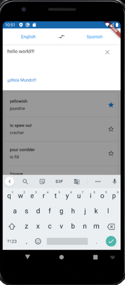
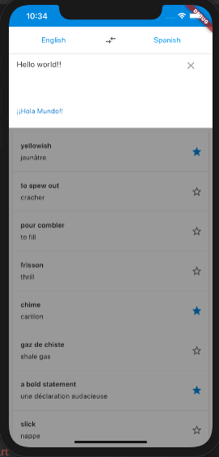

# Flutter Google Translate

My First Flutter application, a Google Translate basic clone following a tutorial by [Appli-chic](https://blog.usejournal.com/flutter-google-translate-part-1-63b50c93d873) 

Contains basic translation, multiple screens, scroll lists, basic buttons and functionalities.

## Main Screen
Android           |  iOS
:-------------------------:|:-------------------------:
  |  

## Language Selection Screen
Android           |  iOS
:-------------------------:|:-------------------------:
  |  

## Translation
Android           |  iOS
:-------------------------:|:-------------------------:
  |  